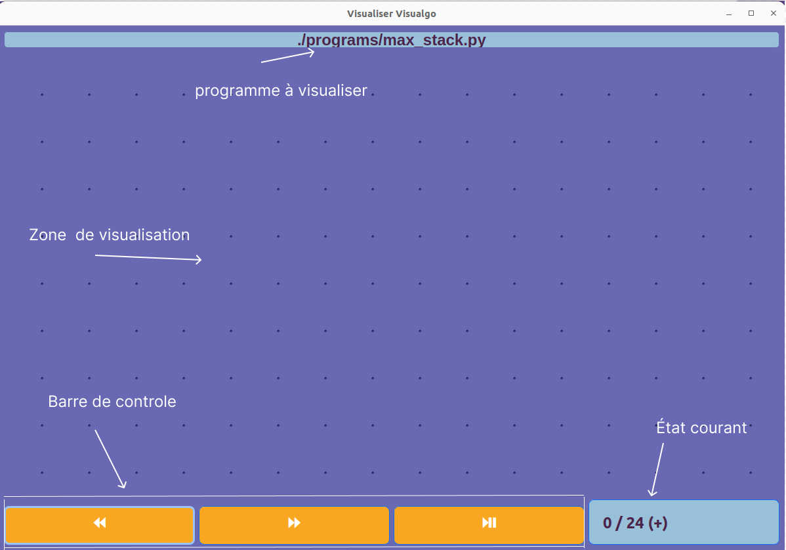

# Using the graphic interface

When running the your files as explain in the previous page, a window will open. It is the graphic interface used to display your program. The following image corresponds to the windows you are supposed to see:

The interface is separated in two main parts:
- A 2D grid where all elements are displayed. The grid is an (almost) infinite plan where the mouse can be used in order to navigate.
- A bottom part where buttons allow you so run, stop, go forward or backward in the display of the execution of the program.