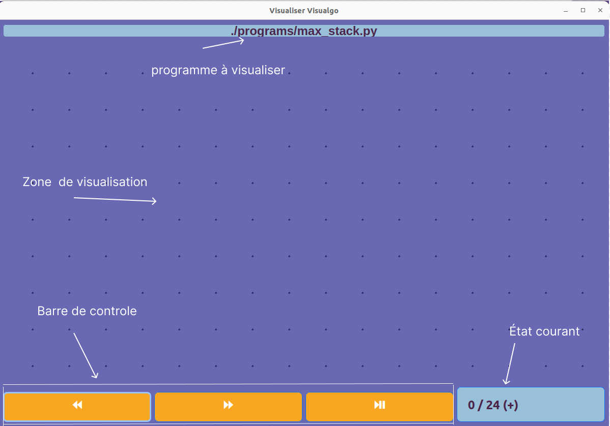

# Using the graphic interface

When running the your files as explain in the previous page, a window will open. It is the graphic interface used to display your program. The following image corresponds to the windows you are supposed to see:

